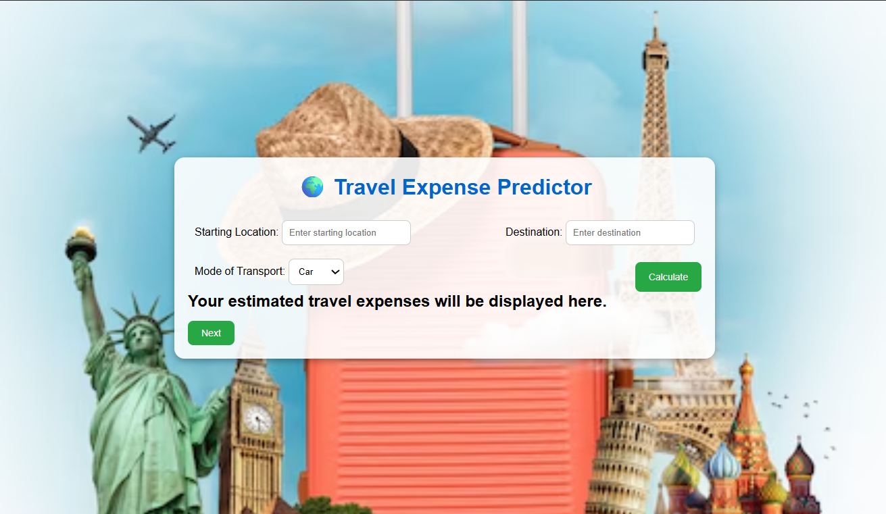
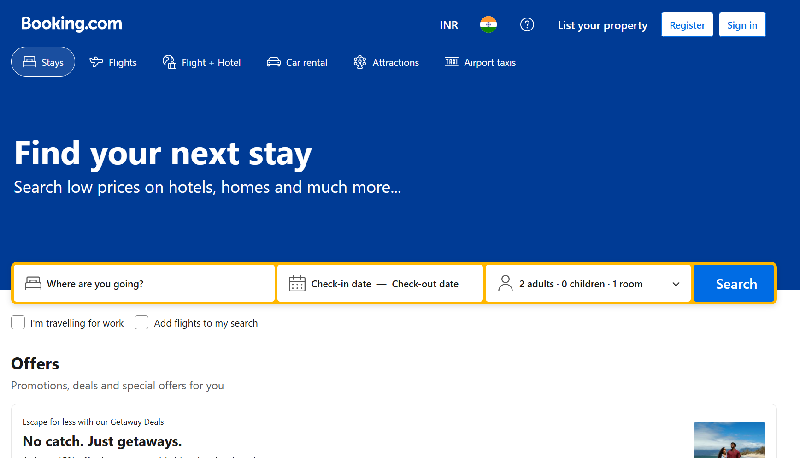
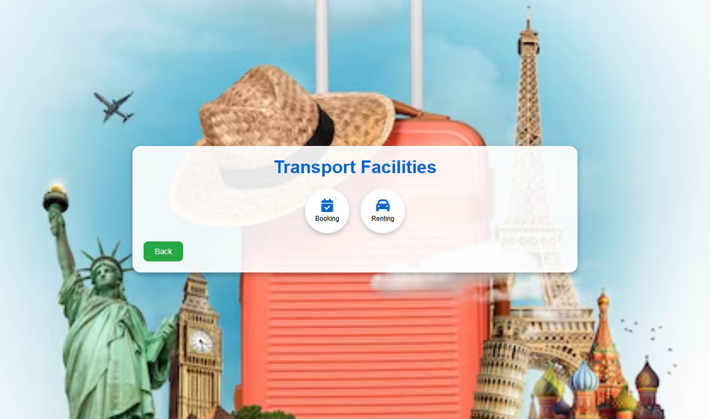
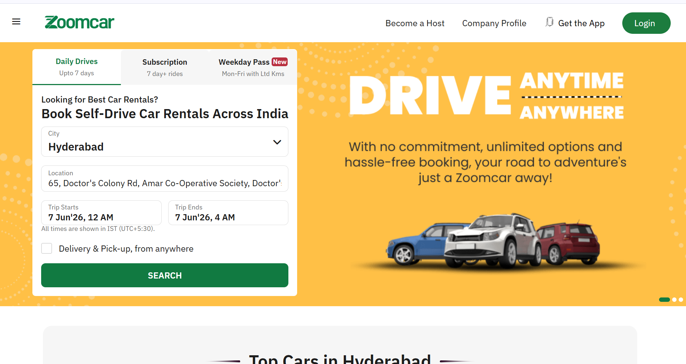
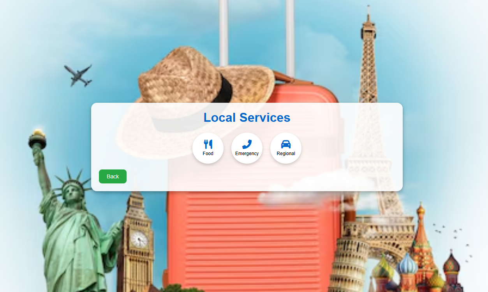
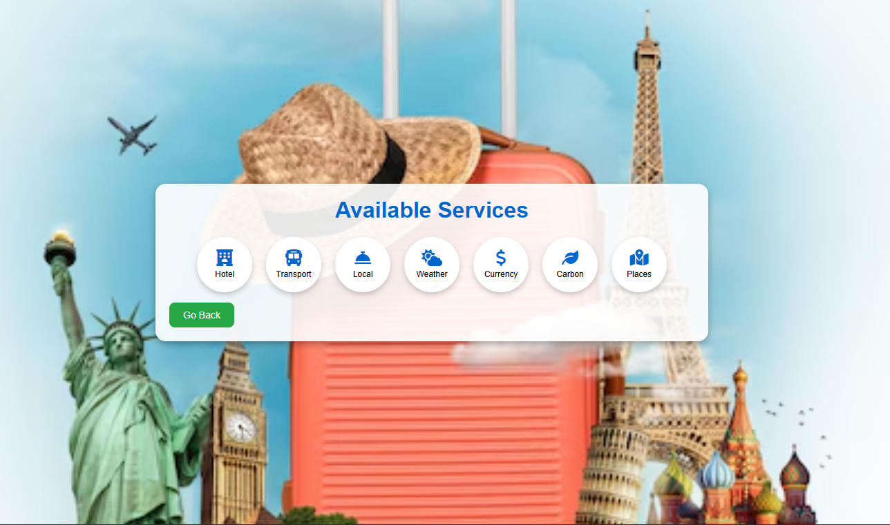

# ✈️ Travel & Tourism Website

> A fully responsive, interactive Travel and Tourism website built using pure HTML, CSS, and JavaScript — designed to showcase destinations, travel packages, and trip planning features for users.


---

## 📌 Table of Contents

- [Project Overview](#-project-overview)
- [Features](#-features)
- [Technologies Used](#-technologies-used)
- [Project Structure](#-project-structure)
- [Prerequisites](#-prerequisites)
- [Step-by-Step Implementation Guide](#-step-by-step-implementation-guide)
  - [Creating index.html](#1-creating-indexhtml)
  - [Styling with style.css](#2-styling-with-stylecss)
  - [Adding Interactivity with script.js](#3-adding-interactivity-with-scriptjs)
- [How to Run the Project](#-how-to-run-the-project)
- [Screenshots](#-screenshots)
- [Challenges Faced](#-challenges-faced)
- [Future Enhancements](#-future-enhancements)
- [Conclusion](#-conclusion)

---

## 🌍 Project Overview

The **Travel & Tourism Website** is a front-end web project that simulates a real-world travel agency platform. It allows users to explore popular travel destinations, browse available tour packages, and get in touch through a contact form — all within a visually appealing and mobile-friendly interface.

This project was built entirely with **HTML**, **CSS**, and **Vanilla JavaScript**, without relying on any frameworks or libraries. It serves as a practical demonstration of core web development skills including layout design, responsive techniques, DOM manipulation, and user interaction handling.

Whether you're a beginner learning web development or a student submitting an academic project, this guide walks you through building the entire website from scratch — step by step.

---

## ✨ Features

- 🏠 **Hero / Banner Section** — Full-screen landing area with a headline, subtext, and a call-to-action button
- 🗺️ **Popular Destinations** — A card-based grid showcasing travel destinations with images, descriptions, and pricing
- 📦 **Tour Packages** — Highlighted packages with details such as duration, inclusions, and cost
- 🔍 **Search / Filter Functionality** — JavaScript-powered filtering to find destinations by name or category
- 📝 **Booking / Contact Form** — A form with client-side validation for user inquiries and bookings
- 🌙 **Smooth Scroll Navigation** — Anchor-based navigation with smooth scrolling between sections
- 📱 **Fully Responsive Design** — Adapts seamlessly across desktops, tablets, and mobile devices
- 🎨 **Hover Animations & Transitions** — CSS-powered animations on cards and buttons
- 🔝 **Back-to-Top Button** — JavaScript-driven scroll-to-top functionality
- 📌 **Sticky Navigation Bar** — Header that stays visible while scrolling

---

## 🛠️ Technologies Used

| Technology | Purpose |
|---|---|
| **HTML5** | Page structure and semantic markup |
| **CSS3** | Styling, layout (Flexbox & Grid), animations, and responsiveness |
| **JavaScript (ES6)** | DOM manipulation, form validation, filters, and interactivity |
| **Google Fonts** | Custom typography for better visual appeal |
| **Font Awesome / Remix Icons** | Icons for navigation, cards, and UI elements |

> **Note:** No frameworks (React, Vue, Bootstrap) or backend technologies were used. This is a pure front-end project.

---

## 📁 Project Structure

```
travel-tourism-website/
│
├── index.html          # Main HTML file — all sections live here
├── style.css           # All styles, media queries, and animations
├── script.js           # JavaScript for interactivity and logic
│
├── assets/
│   ├── images/         # Destination and package images
│   │   ├── hero-bg.jpg
│   │   ├── destination-1.jpg
│   │   ├── destination-2.jpg
│   │   ├── destination-3.jpg
│   │   └── ...
│   └── icons/          # Any custom SVG icons (optional)
│
└── README.md           # Project documentation (this file)
```

---

## ✅ Prerequisites

Before you begin, make sure you have the following:

- A computer running **Windows**, **macOS**, or **Linux**
- A modern web browser: **Google Chrome**, **Firefox**, or **Edge**
- A code editor — **[VS Code](https://code.visualstudio.com/)** is highly recommended
- Basic understanding of **HTML tags**, **CSS properties**, and **JavaScript syntax**
- *(Optional)* **VS Code Live Server Extension** for auto-reloading during development

> 💡 No installations, no package managers, no command-line setup required. Just a browser and a text editor.

---

## 🚀 Step-by-Step Implementation Guide

### 1. Creating `index.html`

The HTML file defines the entire structure of the website. Follow the section-by-section breakdown below.

#### Step 1.1 — Boilerplate Setup

Start with the standard HTML5 boilerplate and link your CSS and JS files.

```html
<!DOCTYPE html>
<html lang="en">
<head>
  <meta charset="UTF-8" />
  <meta name="viewport" content="width=device-width, initial-scale=1.0"/>
  <title>Travel & Tourism</title>

  <!-- Google Fonts -->
  <link href="https://fonts.googleapis.com/css2?family=Poppins:wght@300;400;600;700&display=swap" rel="stylesheet"/>

  <!-- Font Awesome Icons -->
  <link rel="stylesheet" href="https://cdnjs.cloudflare.com/ajax/libs/font-awesome/6.5.0/css/all.min.css"/>

  <!-- Your Stylesheet -->
  <link rel="stylesheet" href="style.css"/>
</head>
<body>

  <!-- All sections go here -->

  <script src="script.js"></script>
</body>
</html>
```

#### Step 1.2 — Navigation Bar

```html
<header id="navbar">
  <nav class="nav-container">
    <div class="logo">
      <i class="fa-solid fa-plane-departure"></i> WanderWorld
    </div>
    <ul class="nav-links" id="navLinks">
      <li><a href="#home">Home</a></li>
      <li><a href="#destinations">Destinations</a></li>
      <li><a href="#packages">Packages</a></li>
      <li><a href="#contact">Contact</a></li>
    </ul>
    <div class="hamburger" id="hamburger">
      <span></span><span></span><span></span>
    </div>
  </nav>
</header>
```

> 💡 The `.hamburger` element is used for the mobile menu toggle — JavaScript will handle showing/hiding `nav-links` on small screens.

#### Step 1.3 — Hero Section

```html
<section class="hero" id="home">
  <div class="hero-content">
    <h1>Explore the World,<br/><span>Your Way</span></h1>
    <p>Discover breathtaking destinations, curated travel packages, and unforgettable experiences.</p>
    <a href="#destinations" class="btn-primary">Start Exploring</a>
  </div>
</section>
```

#### Step 1.4 — Search / Filter Bar

```html
<section class="search-section">
  <div class="search-bar">
    <input type="text" id="searchInput" placeholder="🔍 Search destinations..."/>
    <select id="categoryFilter">
      <option value="all">All Categories</option>
      <option value="beach">Beach</option>
      <option value="mountain">Mountain</option>
      <option value="city">City</option>
      <option value="adventure">Adventure</option>
    </select>
  </div>
</section>
```

#### Step 1.5 — Destinations Section

```html
<section class="destinations" id="destinations">
  <h2 class="section-title">Popular Destinations</h2>
  <p class="section-subtitle">Hand-picked places loved by thousands of travellers</p>

  <div class="destinations-grid" id="destinationsGrid">

    <!-- Destination Card -->
    <div class="dest-card" data-category="beach">
      
      <div class="card-info">
        <h3>Maldives</h3>
        <p>Crystal-clear lagoons and overwater bungalows await you.</p>
        <div class="card-footer">
          <span class="price">From ₹85,000</span>
          <a href="#contact" class="btn-small">Book Now</a>
        </div>
      </div>
    </div>

    <!-- Repeat similar cards for more destinations -->

  </div>
</section>
```

> 💡 Add a `data-category` attribute to each card (e.g., `beach`, `mountain`, `city`). The JavaScript filter uses this to show/hide cards dynamically.

#### Step 1.6 — Packages Section

```html
<section class="packages" id="packages">
  <h2 class="section-title">Our Tour Packages</h2>

  <div class="packages-grid">
    <div class="package-card">
      <div class="package-badge">Best Value</div>
      <h3>🌴 Tropical Escape</h3>
      <ul>
        <li><i class="fa fa-check"></i> 7 Nights / 8 Days</li>
        <li><i class="fa fa-check"></i> Hotel + Flights Included</li>
        <li><i class="fa fa-check"></i> Guided Tours</li>
        <li><i class="fa fa-check"></i> Meals Included</li>
      </ul>
      <div class="package-price">₹1,20,000 <span>/ person</span></div>
      <a href="#contact" class="btn-primary">Get This Deal</a>
    </div>
    <!-- Add more package cards -->
  </div>
</section>
```

#### Step 1.7 — Contact / Booking Form

```html
<section class="contact" id="contact">
  <h2 class="section-title">Book Your Trip</h2>

  <form id="bookingForm" class="booking-form" novalidate>
    <div class="form-group">
      <label for="name">Full Name</label>
      <input type="text" id="name" placeholder="John Doe" required/>
      <span class="error-msg" id="nameError"></span>
    </div>
    <div class="form-group">
      <label for="email">Email Address</label>
      <input type="email" id="email" placeholder="john@example.com" required/>
      <span class="error-msg" id="emailError"></span>
    </div>
    <div class="form-group">
      <label for="destination">Preferred Destination</label>
      <input type="text" id="destination" placeholder="e.g., Goa, Bali"/>
    </div>
    <div class="form-group">
      <label for="message">Message</label>
      <textarea id="message" rows="4" placeholder="Tell us your travel plans..."></textarea>
    </div>
    <button type="submit" class="btn-primary">Submit Enquiry</button>
    <p id="formSuccess" class="success-msg" style="display:none;">
      ✅ Thank you! We'll get back to you shortly.
    </p>
  </form>
</section>
```

#### Step 1.8 — Footer & Back-to-Top Button

```html
<footer>
  <p>© 2024 WanderWorld. All rights reserved. | Made with ❤️ for travellers.</p>
</footer>

<!-- Back to Top Button -->
<button id="backToTop" title="Go to top">
  <i class="fa fa-arrow-up"></i>
</button>
```

---

### 2. Styling with `style.css`

#### Step 2.1 — CSS Variables & Reset

```css
/* ===== CSS Variables ===== */
:root {
  --primary: #0077b6;
  --secondary: #00b4d8;
  --accent: #f77f00;
  --dark: #03045e;
  --light: #caf0f8;
  --white: #ffffff;
  --gray: #f4f4f4;
  --text: #333333;
  --shadow: 0 4px 20px rgba(0, 0, 0, 0.1);
  --radius: 12px;
  --transition: all 0.3s ease;
  --font: 'Poppins', sans-serif;
}

/* ===== Global Reset ===== */
*, *::before, *::after {
  margin: 0;
  padding: 0;
  box-sizing: border-box;
}

body {
  font-family: var(--font);
  color: var(--text);
  line-height: 1.6;
  scroll-behavior: smooth;
}

a {
  text-decoration: none;
  color: inherit;
}

ul { list-style: none; }
img { width: 100%; display: block; }
```

#### Step 2.2 — Navbar Styles

```css
/* ===== Navbar ===== */
#navbar {
  position: fixed;
  top: 0; left: 0;
  width: 100%;
  background: var(--white);
  box-shadow: var(--shadow);
  z-index: 1000;
  transition: var(--transition);
}

.nav-container {
  max-width: 1200px;
  margin: 0 auto;
  padding: 1rem 2rem;
  display: flex;
  justify-content: space-between;
  align-items: center;
}

.logo {
  font-size: 1.5rem;
  font-weight: 700;
  color: var(--primary);
}

.nav-links {
  display: flex;
  gap: 2rem;
}

.nav-links a {
  font-weight: 500;
  color: var(--text);
  transition: var(--transition);
}

.nav-links a:hover { color: var(--primary); }

/* Active/scrolled state */
#navbar.scrolled {
  background: var(--dark);
}
#navbar.scrolled .nav-links a,
#navbar.scrolled .logo { color: var(--white); }
```

#### Step 2.3 — Hero Section

```css
/* ===== Hero ===== */
.hero {
  min-height: 100vh;
  background: linear-gradient(rgba(3, 4, 94, 0.6), rgba(0, 119, 182, 0.5)),
              url('assets/images/hero-bg.jpg') center/cover no-repeat;
  display: flex;
  align-items: center;
  justify-content: center;
  text-align: center;
  color: var(--white);
  padding: 2rem;
}

.hero-content h1 {
  font-size: clamp(2.5rem, 6vw, 5rem);
  font-weight: 700;
  margin-bottom: 1rem;
  line-height: 1.2;
}

.hero-content h1 span { color: var(--accent); }

.hero-content p {
  font-size: 1.2rem;
  max-width: 600px;
  margin: 0 auto 2rem;
  opacity: 0.9;
}
```

#### Step 2.4 — Buttons

```css
/* ===== Buttons ===== */
.btn-primary {
  display: inline-block;
  background: var(--accent);
  color: var(--white);
  padding: 0.8rem 2rem;
  border-radius: 50px;
  font-weight: 600;
  font-size: 1rem;
  border: none;
  cursor: pointer;
  transition: var(--transition);
}

.btn-primary:hover {
  background: #d62839;
  transform: translateY(-3px);
  box-shadow: 0 8px 25px rgba(247, 127, 0, 0.4);
}

.btn-small {
  display: inline-block;
  background: var(--primary);
  color: white;
  padding: 0.4rem 1rem;
  border-radius: 20px;
  font-size: 0.85rem;
  transition: var(--transition);
}

.btn-small:hover { background: var(--dark); }
```

#### Step 2.5 — Destination Cards

```css
/* ===== Section Titles ===== */
.section-title {
  text-align: center;
  font-size: 2rem;
  font-weight: 700;
  color: var(--dark);
  margin-bottom: 0.5rem;
}

.section-subtitle {
  text-align: center;
  color: #666;
  margin-bottom: 3rem;
}

/* ===== Destinations Grid ===== */
.destinations {
  padding: 5rem 2rem;
  max-width: 1200px;
  margin: 0 auto;
}

.destinations-grid {
  display: grid;
  grid-template-columns: repeat(auto-fit, minmax(280px, 1fr));
  gap: 2rem;
}

.dest-card {
  border-radius: var(--radius);
  overflow: hidden;
  box-shadow: var(--shadow);
  background: var(--white);
  transition: var(--transition);
}

.dest-card:hover {
  transform: translateY(-8px);
  box-shadow: 0 12px 30px rgba(0,0,0,0.15);
}

.dest-card img {
  height: 200px;
  object-fit: cover;
  transition: var(--transition);
}

.dest-card:hover img { transform: scale(1.05); }

.card-info {
  padding: 1.2rem;
}

.card-info h3 {
  font-size: 1.2rem;
  margin-bottom: 0.4rem;
  color: var(--dark);
}

.card-footer {
  display: flex;
  justify-content: space-between;
  align-items: center;
  margin-top: 1rem;
}

.price {
  font-weight: 700;
  color: var(--primary);
}

/* Hidden state for filtering */
.dest-card.hidden { display: none; }
```

#### Step 2.6 — Contact Form

```css
/* ===== Contact Form ===== */
.contact {
  background: var(--gray);
  padding: 5rem 2rem;
}

.booking-form {
  max-width: 650px;
  margin: 0 auto;
  background: var(--white);
  padding: 2.5rem;
  border-radius: var(--radius);
  box-shadow: var(--shadow);
}

.form-group {
  margin-bottom: 1.5rem;
}

.form-group label {
  display: block;
  font-weight: 600;
  margin-bottom: 0.4rem;
  color: var(--dark);
}

.form-group input,
.form-group textarea {
  width: 100%;
  padding: 0.75rem 1rem;
  border: 2px solid #ddd;
  border-radius: 8px;
  font-family: var(--font);
  font-size: 0.95rem;
  transition: var(--transition);
  outline: none;
}

.form-group input:focus,
.form-group textarea:focus {
  border-color: var(--primary);
}

.error-msg {
  color: red;
  font-size: 0.8rem;
  margin-top: 0.3rem;
  display: block;
}

.success-msg {
  color: green;
  font-weight: 600;
  margin-top: 1rem;
  text-align: center;
}
```

#### Step 2.7 — Responsive Media Queries

```css
/* ===== Back to Top Button ===== */
#backToTop {
  position: fixed;
  bottom: 30px; right: 30px;
  background: var(--primary);
  color: white;
  border: none;
  border-radius: 50%;
  width: 48px; height: 48px;
  font-size: 1.2rem;
  cursor: pointer;
  display: none;
  box-shadow: var(--shadow);
  transition: var(--transition);
}

#backToTop:hover { background: var(--dark); transform: scale(1.1); }

/* ===== Hamburger Menu ===== */
.hamburger { display: none; flex-direction: column; gap: 5px; cursor: pointer; }
.hamburger span {
  width: 25px; height: 3px;
  background: var(--text);
  border-radius: 3px;
  transition: var(--transition);
}

/* ===== Responsive ===== */
@media (max-width: 768px) {
  .hamburger { display: flex; }

  .nav-links {
    display: none;
    flex-direction: column;
    position: absolute;
    top: 100%; left: 0;
    width: 100%;
    background: var(--white);
    padding: 1.5rem;
    box-shadow: var(--shadow);
    gap: 1rem;
  }

  .nav-links.active { display: flex; }

  .hero-content h1 { font-size: 2.2rem; }

  .destinations-grid {
    grid-template-columns: 1fr;
  }

  .packages-grid {
    grid-template-columns: 1fr;
  }
}
```

---

### 3. Adding Interactivity with `script.js`

#### Step 3.1 — Sticky Navbar on Scroll

```js
// ===== Sticky Navbar =====
const navbar = document.getElementById('navbar');

window.addEventListener('scroll', () => {
  if (window.scrollY > 80) {
    navbar.classList.add('scrolled');
  } else {
    navbar.classList.remove('scrolled');
  }
});
```

#### Step 3.2 — Mobile Hamburger Menu Toggle

```js
// ===== Hamburger Menu Toggle =====
const hamburger = document.getElementById('hamburger');
const navLinks = document.getElementById('navLinks');

hamburger.addEventListener('click', () => {
  navLinks.classList.toggle('active');
});

// Close menu when a link is clicked
navLinks.querySelectorAll('a').forEach(link => {
  link.addEventListener('click', () => {
    navLinks.classList.remove('active');
  });
});
```

#### Step 3.3 — Destination Search Filter

```js
// ===== Destination Search Filter =====
const searchInput = document.getElementById('searchInput');
const categoryFilter = document.getElementById('categoryFilter');
const cards = document.querySelectorAll('.dest-card');

function filterDestinations() {
  const query = searchInput.value.toLowerCase();
  const category = categoryFilter.value;

  cards.forEach(card => {
    const name = card.querySelector('h3').textContent.toLowerCase();
    const cardCategory = card.getAttribute('data-category');

    const matchesSearch = name.includes(query);
    const matchesCategory = (category === 'all') || (cardCategory === category);

    if (matchesSearch && matchesCategory) {
      card.classList.remove('hidden');
    } else {
      card.classList.add('hidden');
    }
  });
}

searchInput.addEventListener('input', filterDestinations);
categoryFilter.addEventListener('change', filterDestinations);
```

#### Step 3.4 — Form Validation

```js
// ===== Form Validation =====
const form = document.getElementById('bookingForm');

form.addEventListener('submit', (e) => {
  e.preventDefault();
  let valid = true;

  const name = document.getElementById('name');
  const email = document.getElementById('email');
  const nameError = document.getElementById('nameError');
  const emailError = document.getElementById('emailError');

  // Reset errors
  nameError.textContent = '';
  emailError.textContent = '';

  // Validate Name
  if (name.value.trim().length < 3) {
    nameError.textContent = 'Please enter your full name (min 3 characters).';
    valid = false;
  }

  // Validate Email
  const emailRegex = /^[^\s@]+@[^\s@]+\.[^\s@]+$/;
  if (!emailRegex.test(email.value.trim())) {
    emailError.textContent = 'Please enter a valid email address.';
    valid = false;
  }

  if (valid) {
    form.reset();
    const successMsg = document.getElementById('formSuccess');
    successMsg.style.display = 'block';
    setTimeout(() => { successMsg.style.display = 'none'; }, 4000);
  }
});
```

#### Step 3.5 — Back to Top Button

```js
// ===== Back to Top Button =====
const backToTop = document.getElementById('backToTop');

window.addEventListener('scroll', () => {
  if (window.scrollY > 400) {
    backToTop.style.display = 'block';
  } else {
    backToTop.style.display = 'none';
  }
});

backToTop.addEventListener('click', () => {
  window.scrollTo({ top: 0, behavior: 'smooth' });
});
```

#### Step 3.6 — Scroll-Reveal Animation (Optional Enhancement)

```js
// ===== Scroll Reveal Animation =====
const observer = new IntersectionObserver((entries) => {
  entries.forEach(entry => {
    if (entry.isIntersecting) {
      entry.target.style.opacity = '1';
      entry.target.style.transform = 'translateY(0)';
    }
  });
}, { threshold: 0.15 });

document.querySelectorAll('.dest-card, .package-card').forEach(el => {
  el.style.opacity = '0';
  el.style.transform = 'translateY(40px)';
  el.style.transition = 'opacity 0.5s ease, transform 0.5s ease';
  observer.observe(el);
});
```

---

## ▶️ How to Run the Project

### Option 1 — Open Directly in Browser

1. Download or clone the repository:
   ```bash
   git clone https://github.com/your-username/travel-tourism-website.git
   ```
2. Open the project folder.
3. Double-click `index.html` — it opens in your default browser.

### Option 2 — Using VS Code Live Server *(Recommended)*

1. Open the project folder in **VS Code**.
2. Install the **Live Server** extension (by Ritwick Dey) from the Extensions marketplace.
3. Right-click `index.html` → **"Open with Live Server"**.
4. The site opens at `http://127.0.0.1:5500` and auto-reloads on save.

### Option 3 — Using Python's HTTP Server

```bash
# Navigate into the project folder
cd travel-tourism-website

# Python 3
python -m http.server 5500

# Then open: http://localhost:5500
```

---

## 📸 Screenshots

> **Note for contributors:** Replace the placeholder descriptions below with actual screenshots of your project.

| Section | Preview |
|---|---|
| 🏠 Hero / Landing Page | `[ Screenshot of the hero banner with CTA button ]` |
| 🗺️ Destinations Grid | `[ Screenshot of the card grid with destination images ]` |
| 🔍 Search & Filter | `[ Screenshot showing the search bar filtering results ]` |
| 📦 Tour Packages | `[ Screenshot of the packages section ]` |
| 📝 Contact Form | `[ Screenshot of the booking/contact form ]` |
| 📱 Mobile View | `[ Screenshot of the mobile responsive layout ]` |

> **How to add screenshots:**
> 1. Take screenshots of each section.
> 2. Save them inside `assets/screenshots/`.
> 3. Replace each placeholder above with:
>    ```markdown
>    
>    ```

---

## 🧩 Challenges Faced

During the development of this project, several interesting problems were encountered and solved:

**1. Responsive Navigation**
Building a hamburger menu that works cleanly on mobile — toggling a CSS class via JavaScript while ensuring the menu closes when a link is clicked — required careful event handling.

**2. Card Filtering Logic**
Combining text search with a category dropdown meant both conditions needed to be evaluated simultaneously on every keystroke and dropdown change, which required a unified filter function.

**3. CSS-Only Hover Image Zoom**
Achieving a smooth image zoom inside a card without JavaScript required using `overflow: hidden` on the parent and `transform: scale()` on the image, a trick that isn't immediately obvious.

**4. Sticky Navbar Color Change on Scroll**
Making the transparent navbar switch to a solid dark background as the user scrolls required a scroll event listener that toggles a CSS class, rather than inline style manipulation.

**5. Form Validation Without a Library**
Implementing regex-based email validation and real-time error messaging from scratch — without using browser defaults — needed careful DOM manipulation and UX consideration.

---

## 🔮 Future Enhancements

Here are features that could be added to extend this project further:

- [ ] 🌐 **Backend Integration** — Connect to Node.js/Express or Firebase for real booking storage
- [ ] 🔐 **User Authentication** — Login/signup system for registered travellers
- [ ] 🗓️ **Date Picker** — Integrate a date range picker for trip duration selection
- [ ] 🗺️ **Google Maps API** — Embed an interactive map showing destination locations
- [ ] 💬 **Reviews & Ratings** — Allow users to submit and view travel reviews
- [ ] 🌍 **Multi-language Support** — i18n support for Hindi, Telugu, and other regional languages
- [ ] 💳 **Payment Gateway** — Integrate Razorpay or Stripe for mock booking payments
- [ ] 🌙 **Dark Mode** — Toggle between light and dark themes with localStorage persistence
- [ ] ♿ **Accessibility (a11y)** — Improve ARIA labels, keyboard navigation, and screen reader support
- [ ] ⚡ **Performance Optimization** — Lazy loading images, WebP format, and minified assets

---

## ✅ Conclusion

This **Travel & Tourism Website** project demonstrates how powerful and expressive a website can be using only HTML, CSS, and JavaScript — no frameworks needed.

Throughout this project, the following core web development concepts were applied:

- Semantic HTML5 structure for better readability and SEO
- CSS Flexbox and Grid for flexible, modern layouts
- CSS custom properties (variables) for maintainable theming
- JavaScript DOM manipulation for dynamic filtering and interactivity
- Client-side form validation using regular expressions
- Responsive design principles using media queries
- The Intersection Observer API for scroll-triggered animations

This project is an excellent foundation for learners who want to go deeper into front-end development. The next natural step would be adding a backend with **Node.js** or integrating a cloud database like **Firebase** to make the bookings functional.

---

<div align="center">

**⭐ If you found this helpful, please star the repository!**

Made with ❤️ | [MIT License](LICENSE)

</div>
## 📸 Screenshots

### 🏠 Home Page


### 🏨 Booking Section


### 🚗 Transport Services


### 🚙 Zoomcar Services


### 🛎️ Local Services


### 🏢 Other Services

